## A Combined-Learning Based Framework for Improved Software Fault Prediction

Note：软件质量分析课程上关于论文《A Combined-Learning Based Framework for Improved Software Fault Prediction》的代码复现

#### 摘要

对于软件失效预测模型（SFP)，现如今存在的问题是：软件度量指标大多，或多或少存在冗余特征或者不相关的特征，导致不知道使用哪个，而且数据集存在样本不平衡问题。

本文的目的是使用多个特征选择模型来独立性检验软件度量指标

数据集包含OOM（面向对象）的度量指标，以及SCM（静态代码）的度量指标

结果表明：

- 对于SCM指标，随机森林（RF）结合**信息增益**（Information Gain）模型取得最优的性能，ROC值达到0.993
- 对于OOM指标，随机森林（RF）结合**相关特征选择**（CFS）模型取得最优性能，ROC值达到0.909

因此对于软件度量指标需要谨慎检验，并且要选择合适的特征选择模型，才能对软件缺陷进行预测。而且数据平衡（DB）对于模型的鲁棒性至关重要。

#### 假设

H1：在SCM,OOM指标上，FS和DB的结合（使用SMOTE策略）可以提高SFP分类性能

H2：合适的FST可以有效对SCM,OOM特征进行降维，提高SFP性能

#### 分析思路

1）首先单独分析某个软件度量指标，使用8种分类模型跑交叉验证（SCM,OOM），性能结果用ROC表示。

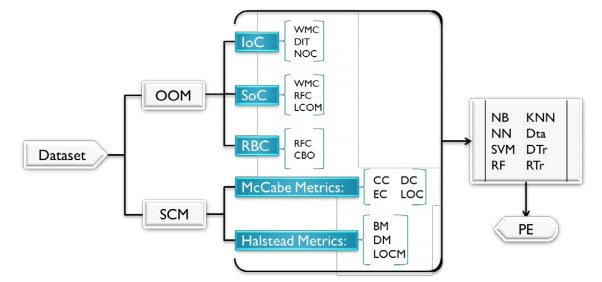

2）其次使用三种属性评估模型CFS，PCA，IG以及三种搜索算法BF(Best First)，GS(GreedyStepWise)，R(Ranker)。

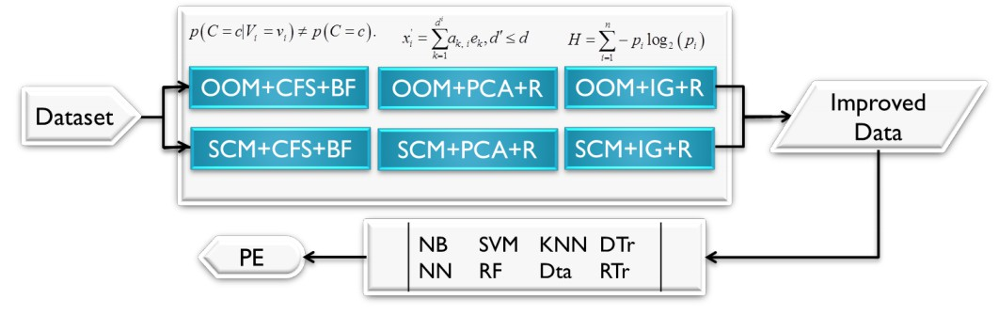

3）接着使用SMOTE策略进行DB，DB操作只对选择的特征有效

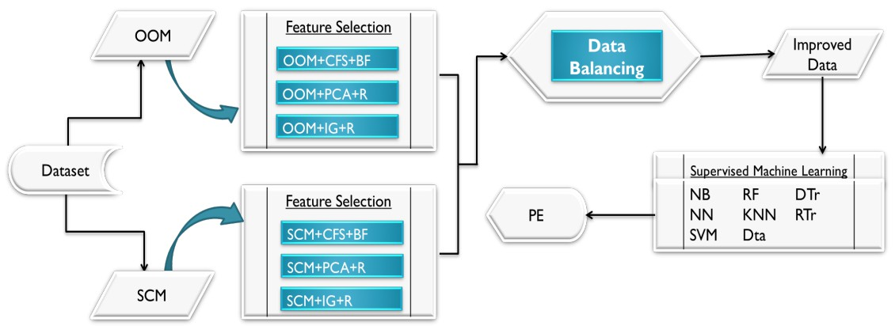

#### 指标

**SCM**:  McCabe和Halstead作为软件质量的评估指标；

- McCabe以最小的功能模块进行测量，用来反映该模块的通路数（被调用次数）。包括Cyclomatic Complexity (CC), Essential  Complexity (EC), Design Complexity (DC) and LOC. 
- Halstead是对模块中某些特有运算符进行统计。包括Base Measures (BM), the  Derived Measures (DM), and LOC Measures (LOCM).

**OOM**: 根据Chidamber和Kemerer，OOM对于类级别的度量可分为3种。

- 单个类 Identification of Classes（IoC）：Weighted Methods for Class (WMC), Depth of  Inheritance Tree (DIT) ， Number of Children (NOC)
- 语义类 Semantics of Classes (SoC) ：Weighted Methods for Class (WMC),  Response for Class (RFC) ，Lack of Cohesion of  Methods (LCOM)
- 类间关系 Relationships  Between Classes (RBC)：Response for  Class (RFC) ，Coupling Between Objects (CBO).

#### 算法

- 相关性特征选择 CFS：CFS能够快速识别非相关，冗余的含噪声特征，如果某个特征对于分类结果具有高相关性，而与其他特征相互独立，CFS可以识别出这种特征来。使用Best First和GreedyStepwise搜索算法。[A*算法 和 最佳优先搜索算法（Best-First-Search）](https://www.jianshu.com/p/617d4a47eac4)，[特征选择之-CFS（Correlation-based Feature Selection）](https://zhuanlan.zhihu.com/p/51710394)，[SFS与SBS特征选择算法](https://www.omegaxyz.com/2018/04/03/sfsandsbs/)

  [特征选择之基于相关性的特征选择（CFS）](https://blog.csdn.net/littlely_ll/article/details/71545929)

- 主成分分析 PCA：对输入的数据进行降维操作 [主成分分析（PCA）原理详解](https://blog.csdn.net/program_developer/article/details/80632779)

  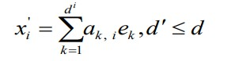

- 信息增益 IG：InfoGain = H(parent) – [weighted] average H(child), where H is the information entropy

  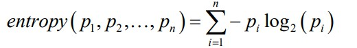

- SMOTE过采样（Synthetic Minority Over-sampling Technique）：通过合成数据进行上采样比替换方式的上采样在小数据集上效果好。参考[类别不平衡问题之SMOTE算法（Python imblearn极简实现）](https://blog.csdn.net/nlpuser/article/details/81265614)，[数据不平衡问题——SMOTE算法赏析](https://blog.csdn.net/qq_33472765/article/details/87891320)，[imbalanced-learn 0.8.0](https://pypi.org/project/imbalanced-learn/#id32)，[ML之LoR：利用信用卡数据集(欠采样{Nearmiss/Kmeans/TomekLinks/ENN}、过采样{SMOTE/ADASYN})同时采用LoR算法(PR和ROC评估)进行是否欺诈二分类](https://blog.csdn.net/qq_41185868/article/details/107491437)

#### 实验

数据集：NASA PROMISE中4个数据集；对于SCM（mc1，jm1)；对于OOM（[Camle1.6](https://figshare.com/articles/dataset/Software_Defect_Prediction_Dataset/13536506)，prop-4，这俩数据集真难找）

分别使用3种特征选择(PCA，FCS，IG)技术(FST），比较正常情况下、加了第i种FST，加了第i种FST和DB 在ROC评价上的区别。

对于**mc1** dataset：

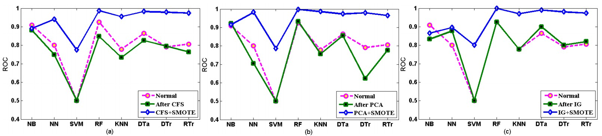

对于**jm1** dataset：

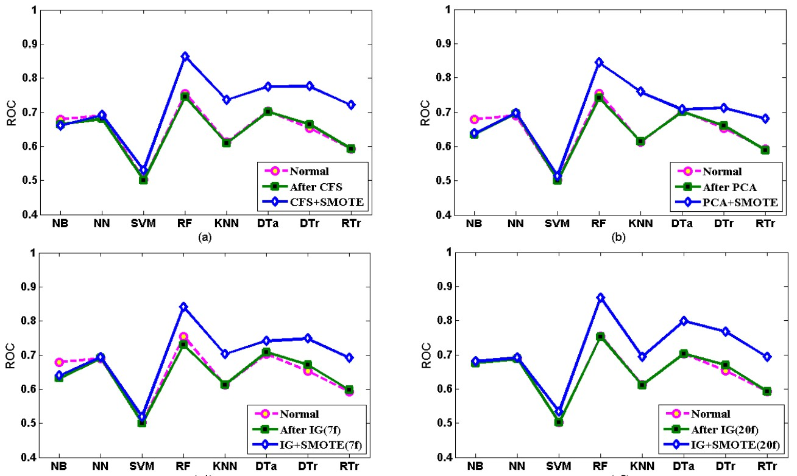

对于**camel-1.6** dataset：

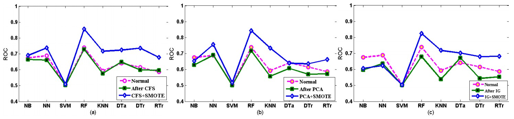

对于**prop-4** dataset：

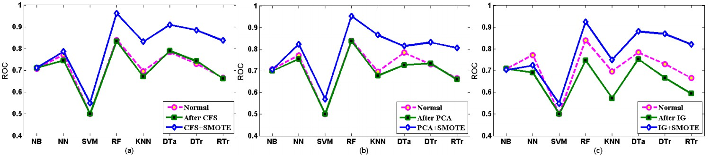

#### 结论

实验：在数据平衡下进行特征选择，对不同模型（NB，NN，SVM，RF，KNN，DTr，RTr）的性能进行研究，采用NASA（2个含SCM，2个含OOM）和AEEEM数据集。

采用的特征选择技术包括：相关特征选择模型，PCA和Information Gain（IG） 


#### 仿真

**PCA，IG，CFS筛选特征：**

- PCA得到特征中的主成分，但是不清楚主成分对应原数据集中的特征究竟是什么

- IG，CFS可以从所有指标中筛选出多个得分排在前k个的指标

**SMOTE对训练数据集类别数量进行平衡**

```python
#JM1.csv  label = Fault 二分类
Counter({1: 6144, 0: 1576})
Counter({0: 6144, 1: 6144})

#camel-1.6.csv  label= BugNum 多分类
Counter({0: 776, 1: 113, 2: 29, 3: 18, 4: 13, 5: 6, 7: 4, 11: 3, 18: 1, 17: 1, 13: 1})
#暂时没有使用SMOTE
```

对于四个数据集，在ROC评估准则下比较不同模型的性能

**JM1.csv：**

- Knn:  AUC平均0.51

  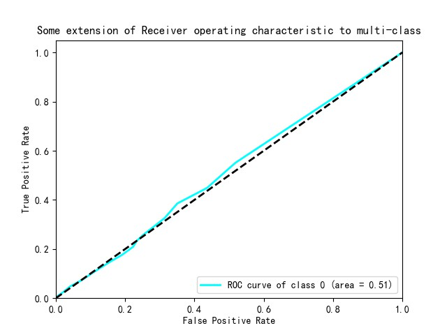

- NB： AUC平均0.48

  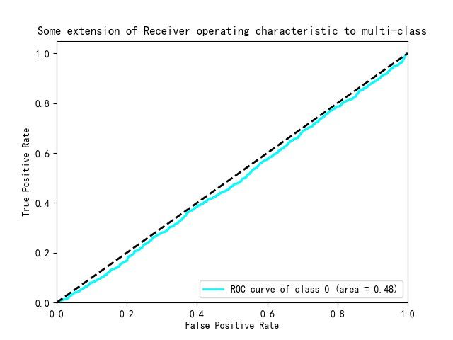

- DTr：AUC平均0.50

  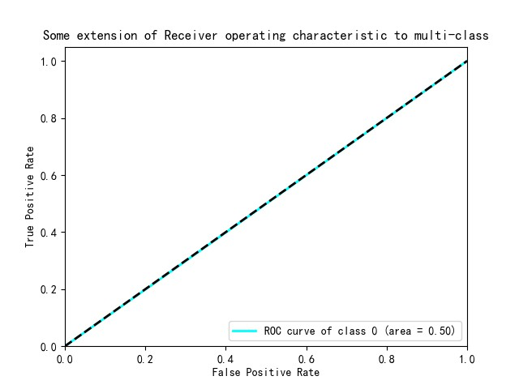

- RF：AUC平均0.50

  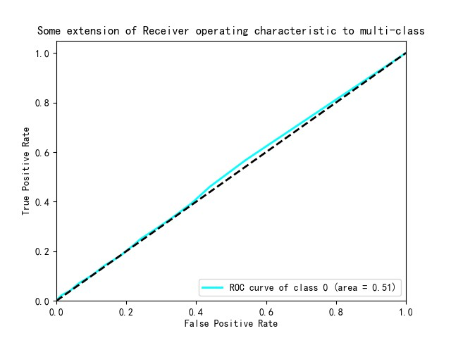

- Logistic：AUC平均0.48

  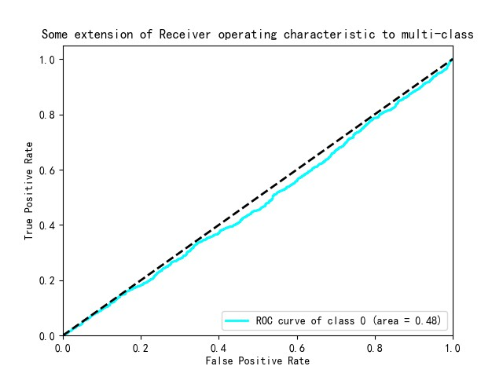

**MC1.csv：**

**camel.csv：**

- Knn:  AUC最高为0.51

  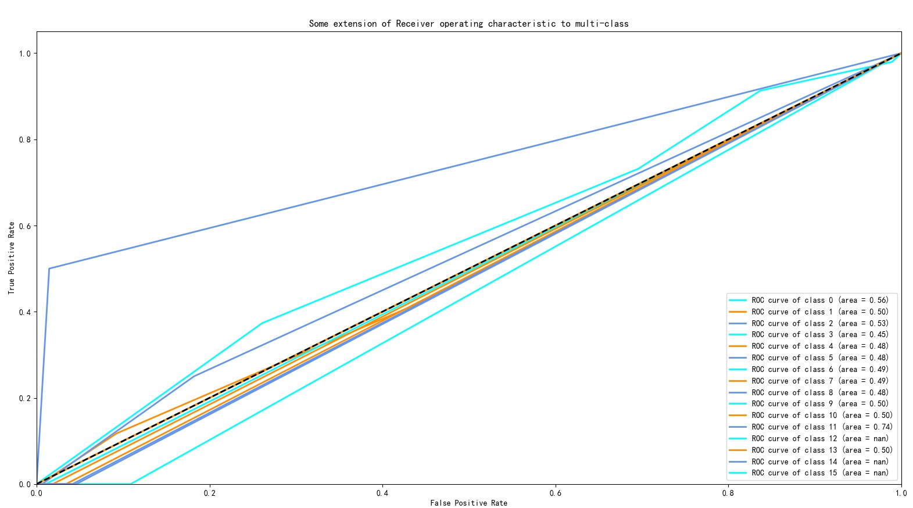

- NB： AUC最高为0.48

  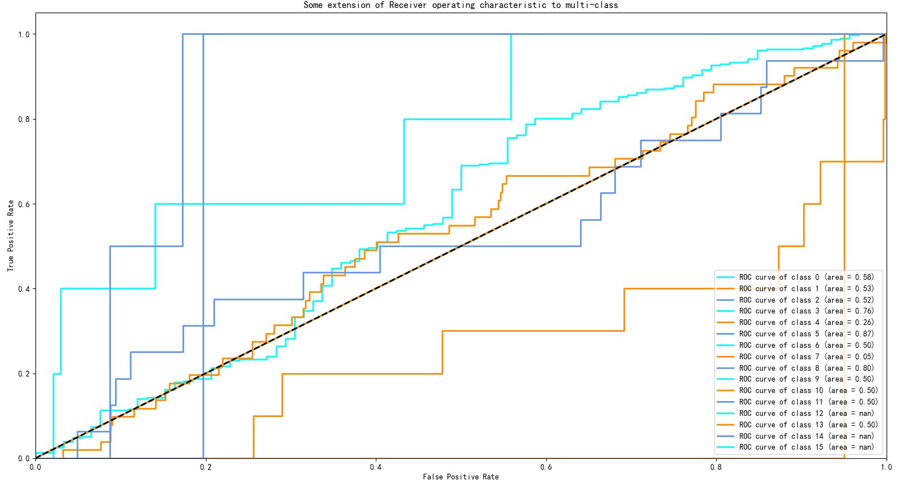

- DTr：AUC平均0.50

  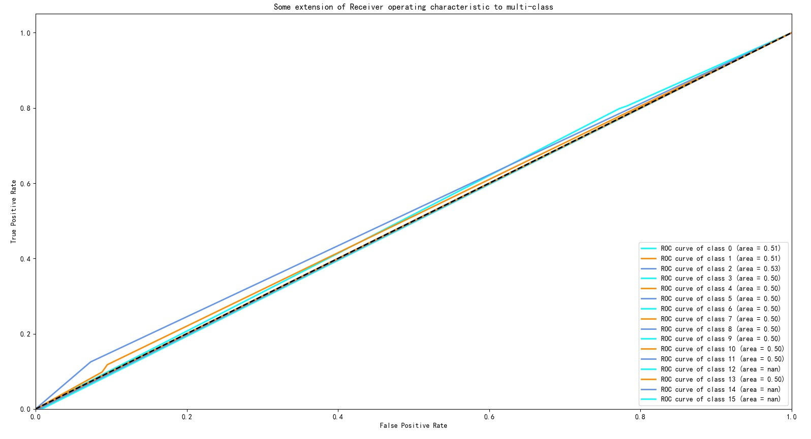

- RF：AUC平均0.50

  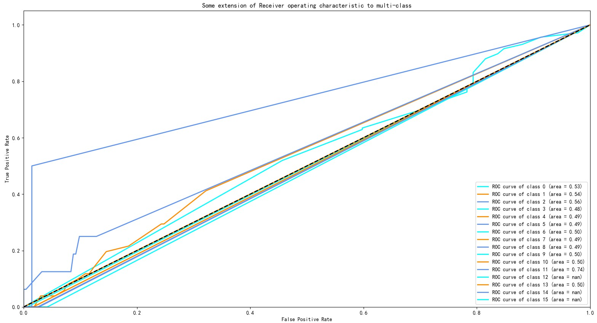

- Logistic：AUC平均0.48

  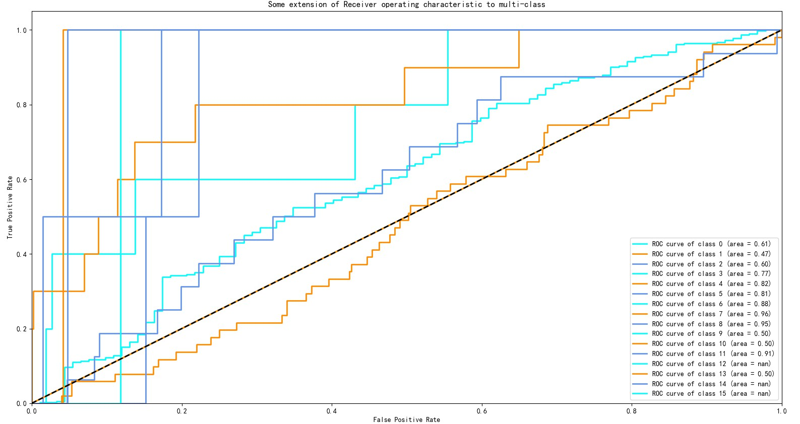

#### 反思

1、这篇论文主要是为了在某个度量指标下（SCM或者OOM），寻找在数据平衡下不同特征选择算法和不同的分类器之间的最优结合关系。本文用到的分类器模型共8个（朴素贝叶斯，人工神经网络，支持向量机，随机森林，K近邻，决策树，决策表，随机树）。由于不太清楚决策表和随机树模型究竟是什么，因此在代码复现中，我们选择前6个模型进行实验。

2、由于模型较多，数据集较多，比较分析过程比较繁琐，在复现时只使用JM，Camel1.6数据集进行实验。本文中用到的ROC值，按我的理解，应该是指ROC曲线下所围成的面积，即AUC，一般是AUC越大，分类性能越好。也许代码在细节处编写不正确，得到的结论和原文不太一致。


4、个人感觉

内容看似挺丰富，但是在预处理过程中，模型和算法在结合时显得有点生硬，可能是由于模型比较多的原因，作者并没有具体给出为什么要使用这些特征选择算法和数据平衡算法，只是基于原先的两个假设，为了做对比而对比。通过实验结果作者只给出比较细节的建议，没有提出更多宏观上的建议。